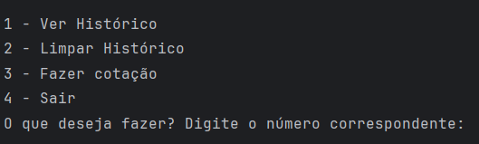
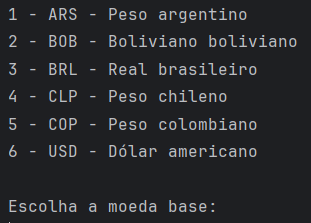
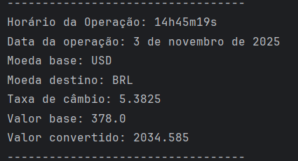

<h1 align="center">Conversor de Moedas</h1>

Este projeto utiliza a Exchange-API para realizar conversão entre uma variedade de moedas diferentes, sendo elas:

1 - ARS - Peso argentino

2 - BOB - Boliviano boliviano

3 - BRL - Real brasileiro

4 - CLP - Peso chileno

5 - COP - Peso colombiano

6 - USD - Dólar americano

<h1 align="center">Como utilizar:</h1>

Ao abrir a aplicação, você verá um menu com estas opções:

Esta aplicação é capaz de registrar o seu histórico
de cotações realizadas, com data e hora, em um arquivo json.
Ao usar a opção de fazer uma cotação, você verá um menu como este:

Após escolher sua opção, você deverá escolher a moeda "destino", e então o valor que deseja converter.
Após isso, você receberá sua informação, e o registro no histórico, para consulta futura, conforme desejar.
Exemplo de resultado no histórico:

<h1>Autor</h1>
 José Daniel Silva de Araújo(https://github.com/ZeDaniel06)
